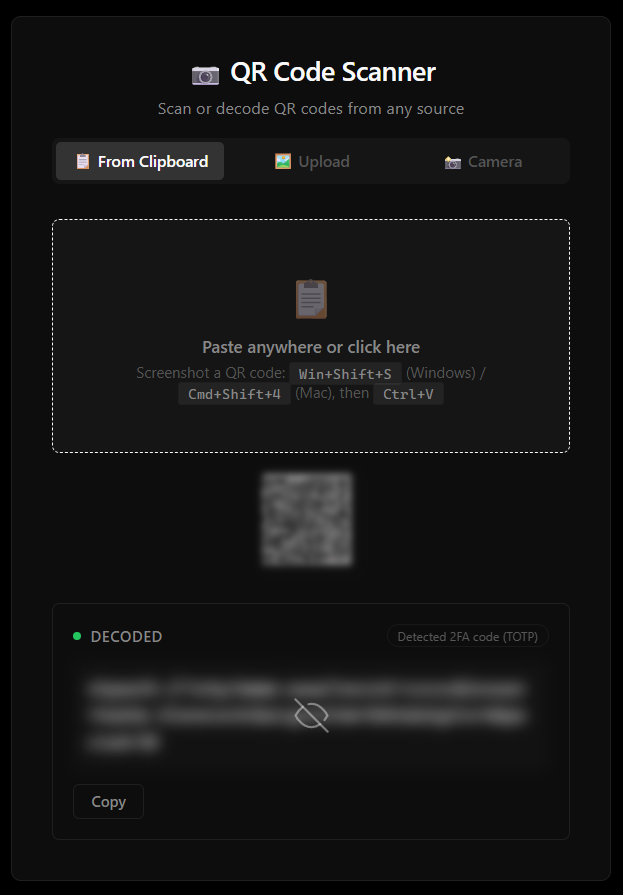

# qrscan-web

A privacy-first QR code scanner PWA. Decode QR codes from your clipboard, image files, or camera — with blurred results that require explicit user action to reveal.



## Features

### Three ways to scan

| Method | How it works | Best for |
|--------|-------------|----------|
| **📋 Paste** | Paste a screenshot (Ctrl+V) anywhere on the page, or click the paste zone to auto-read your clipboard | Screenshots from Win+Shift+S / Cmd+Shift+4 |
| **🖼️ Upload** | Drag & drop an image file, or click to browse | Saved QR images, photos |
| **📸 Camera** | Live camera feed with real-time QR detection | Physical QR codes in the real world |

### Privacy-first by design

**Everything is blurred until you choose to see it.** Decoded content is hidden behind a blur with an eye-off icon. Click to reveal, click again to re-blur. No accidental exposure.

**Smart content preview.** Before you reveal, a subtle pill tells you what kind of content was detected — URL, 2FA code, Wi‑Fi credentials, contact card, email, phone number, JSON, hex, Base64, or plain text. You know what you're about to see without seeing it.

**Clipboard auto-expiry.** When you copy decoded content, it's automatically cleared from your clipboard after 2 minutes. A live countdown shows exactly how long until it's wiped.

**Blurred paste preview.** Pasted screenshots appear as a thumbnail with a soft blur and reduced opacity — enough to confirm you pasted the right image, not enough to expose sensitive content.

### Seamless interactions

**Paste anywhere.** No need to click into a specific field. Press Ctrl+V anywhere on the page and your screenshot is decoded instantly.

**Auto-detect on return.** Switch back to the app after taking a screenshot, and it automatically reads your clipboard. Screenshot → Alt+Tab → already decoded. No extra clicks.

**One-click copy.** The copy button is always visible, even while content is blurred. Copy without ever revealing.

### Installable as a native app

Install to your device as a Progressive Web App. Opens in its own window, appears in your app drawer and Alt+Tab switcher, and works offline.

### Clean, distraction-free design

Pure black background, crisp typography (Inter for UI, JetBrains Mono for decoded content), and minimal chrome. Nothing competes for your attention — just the scan result.

## Getting Started

```bash
npm install
npm run dev      # → http://localhost:5173
npm run build    # Production build to dist/
```

## License

MIT